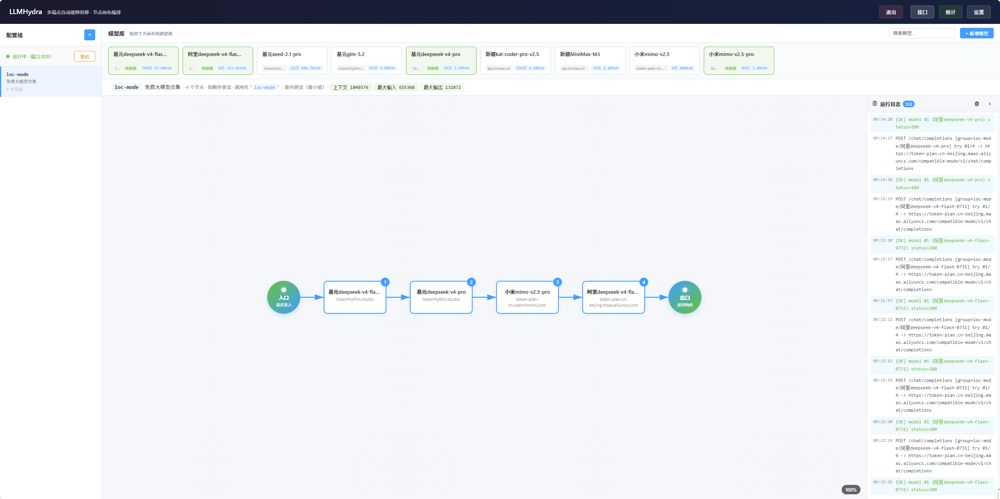
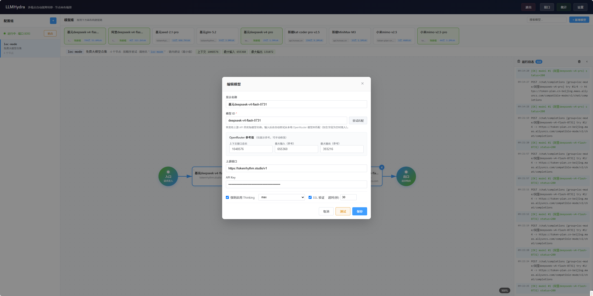
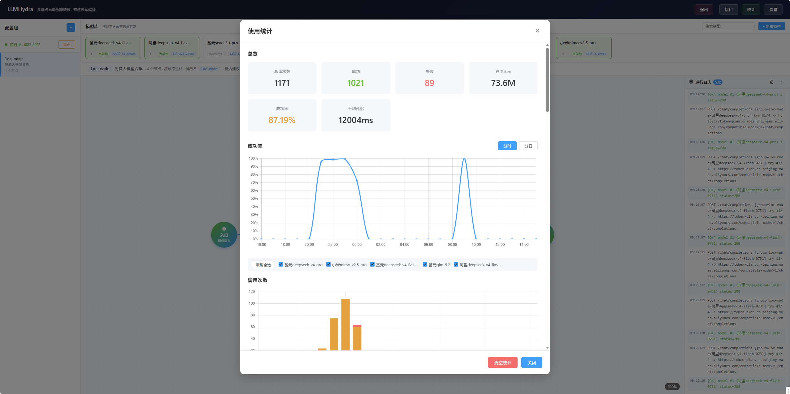

# LLMHydra 🐉

> **多端点自动故障转移的 LLM 代理网关 —— 一个端点挂了，下一个立刻接上。**



LLMHydra 是一个**轻量级、OpenAI 兼容**的 LLM 代理服务，以**节点画布**方式进行可视化编排：把多个模型端点串成一条"重试链"，当某个端点返回错误或超时时自动跳到下一个端点，对外始终暴露统一的 OpenAI 兼容 API。

适合用 Trae、Cursor、Cherry Studio、ChatBox 等工具做日常开发的同学 —— 不再被"突然 429 / 5xx"打断思路，也不会因为某个三方通道挂了就要重写接入。

---

## ✨ 核心特性

- 🔁 **多端点自动故障转移**：401/403/429、5xx 错误、连接失败、超时统统自动切换下一个端点
- 🧯 **熔断器**：端点连续失败达到阈值后自动跳过一段时间，可在线热调整阈值与时长
- 🔑 **代理密钥**：本地代理必须携带 `proxy_key`，避免被滥用，可随时一键作废旧密钥
- 🌊 **SSE 流式透传**：完整支持 `stream: true` 的流式响应，连接建立后**不再切换端点**（避免半截丢包）
- 🎨 **节点画布 UI**：ComfyUI 风格的拖拽编排，支持缩放、平移、重排、节点拖入拖出
- 🧪 **设置实时生效**：熔断参数、监听端口在 UI 调整即可，无需重启
- 🧠 **OpenRouter 模型库参考值**：一键拉取官方模型列表，编辑模型时自动匹配上下文窗口 / 输入输出 token（仅作为参考，不影响转发）
- 📈 **使用统计**：SQLite 持久化请求明细，多维度聚合 + 成功率折线 + 调用量柱状
- 📰 **实时运行日志**：内存环形缓冲 + SSE 推送，前端面板实时滚动
- 🧬 **JSON 实时存储**：每次修改立刻落盘，无数据库依赖

---

## 🖼 主界面一览

开箱即用的管理面板分为五块：

| 区域 | 功能 |
|---|---|
| 左侧「配置组」 | 配置组列表（对外暴露的 model 名），可新增、重命名、删除、一键重启 |
| 顶部「模型库」 | 已配置的模型卡片，拖拽到画布即可加入重试链 |
| 中部「节点画布」 | 当前配置组的重试链编排区，圆形节点为起止，中间为模型节点 |
| 右侧「运行日志」 | 实时滚动展示每次请求的成功 / 失败 / 切换记录，可一键清空 |
| 顶部「接口 / 统计 / 设置」 | 查看代理密钥、调用示例、聚合数据、调整熔断参数 |

---

## 🎨 节点画布：把多个端点串成一条链


- **从顶部模型库拖拽模型到画布**，按顺序排列成一条重试链；
- 鼠标滚轮缩放（25%~200%，右上角实时显示百分比），空白处按住拖拽平移；
- 节点之间可互相拖拽排序、拖到链首 / 链尾、拖出画布删除；
- 点击节点打开「编辑模型」弹窗（见下节）；
- 所有改动实时保存到 `proxy_config.json`。

> 画布里看到的**节点顺序**就是请求时的**重试顺序**：第 1 个失败立刻尝试第 2 个、第 3 个……一路到链尾才宣告 `[ALL-FAIL]`。

---

## 🔧 模型编辑：每个端点都可以独立调



每个模型可独立配置：

| 字段 | 说明 |
|---|---|
| 显示名称 | 仅用于 UI 展示 |
| 模型 ID | 调用上游 API 时使用的真实模型标识（如 `deepseek-chat`） |
| 端点 URL | 上游 API 地址，例如 `https://api.deepseek.com/v1` |
| API Key | 该端点的密钥（可选） |
| 超时时间 | 端点超时秒数，超出自动切换下一个（默认 30s） |
| SSL 验证 | 是否校验上游 HTTPS 证书（默认开启，自签证书可关） |
| 强制 Thinking | 注入 `{thinking:{type:"enabled"}, reasoning_effort:"..."}` |
| 推理强度 | `low` / `medium` / `high` / `max`（仅开启 Thinking 时生效） |
| 上下文窗口总长 | OpenRouter 参考值，可手动修改 |
| 最大输入 / 输出 | OpenRouter 参考值，自动匹配命中时填入 |

**模型 ID 输入框右侧的「尝试匹配」按钮**可在未输入完成时主动触发匹配；正常输入会在停手 500ms 后自动尝试匹配（仅在字段为空时填入，不会覆盖用户已填的值）。

保存前可点「测试」对该端点发起一次真实探测，立即查看 HTTP 状态与响应内容。

---

## 📈 使用统计：实时看清每条链的成色



每次代理请求（含成功 / 失败 / 熔断跳过）都会写入 `stats.db`（SQLite WAL 模式），前端「统计」弹窗聚合展示：

- **总览**：总请求数、成功率、平均延迟、Token 总量
- **成功率折线**：按模型分组，可切换「同时 / 每日」视图，直观看出哪条链路稳
- **调用次数柱状**：按时段分布，定位高峰
- **按模型 / 按配置组**：聚合单条链路或单个端点的成功 / 失败 / 跳过 / 平均延迟 / Token / 最后使用时间
- **最近请求 / 按小时 / 按天**：明细和历史回放
- **清空统计**：一键归零

> 统计默认在应用根目录 `stats.db`。若部署目录只读（如 PaaS），服务会自动回退到系统临时目录以保证统计可用，也可通过环境变量 `STATS_DB_PATH` 指定可写位置。统计不可用时仅降级，不影响代理主流程。

---

## 🏗 架构

```
┌─────────────┐      OpenAI 兼容 API       ┌──────────────────────────┐
│   AI 工具    │ ──────────────────────────► │        LLMHydra           │
│ (Trae/Cursor│     POST /v1/chat/completions │  ┌────────────────────┐  │
│ /Cherry...) │   {"model":"配置组ID",...}     │  │ 重试链 (chain)      │  │
└─────────────┘    Authorization: Bearer PK │  │ 模型 A ─► 模型 B ─►  │  │
                                            │  │ 模型 C (依次重试)     │  │
                                            │  │ + 熔断器 / 统计 / 日志│  │
                                            │  └────────────────────┘  │
                                            │        │                 │
                                            │        ▼                 │
                                            │  ┌────────────────────┐  │
                                            │  │ 管理 API (/api/*)   │  │
                                            │  │ + 节点画布 Web UI   │  │
                                            │  └────────────────────┘  │
                                            └──────────────────────────┘
```

---

## 🚀 快速开始

### 环境要求

- Node.js 18+
- pnpm 10+（项目使用 pnpm workspace）

### 安装与启动

```bash
# 1. 安装依赖
pnpm install

# 2. 启动开发环境（前端 + 后端并行）
pnpm dev

# 或分别启动
pnpm dev:server   # 仅启动服务端（http://localhost:8093）
pnpm dev:client   # 仅启动前端（http://localhost:5173）
```

- 管理面板：<http://localhost:5173>
- 代理服务：<http://localhost:8093>（端口可在面板中修改）

> ⚠️ 首次使用请先通过管理面板添加模型和配置组。配置保存在 `proxy_config.json`（含 API Key 与代理密钥，已加入 `.gitignore`），统计保存在 `stats.db`。

### 生产构建

```bash
pnpm build        # 仅构建前端到 client/dist
pnpm --filter llm-hydra-server start   # 生产模式启动服务端
```

### 打包分发

```bash
pnpm run pack:zip   # 打包为 llm-hydra-v<版本>-<时间戳>.zip（输出到项目根目录）
```

打包自动排除：`node_modules`、`stats.db` 及 WAL 文件、`proxy_config.json`（含密钥）、`.git` / `.idea` / `.workbuddy` / `.pnpm-store`、日志与历史 zip。收到压缩包后执行 `pnpm install && pnpm start` 即可运行（已含 `client/dist` 构建产物）。

---

## 🎮 使用方式

### 1. 添加模型

参见上文 [模型编辑](./Snipaste_2026-08-17_15-10-51.png) 章节。

### 2. 创建配置组

创建配置组时自定义组 ID（仅允许中英文、数字和 `-`），该 ID 就是对外调用时的 `model` 字段值。

### 3. 编排重试链

从模型库**拖拽模型**到画布中，按顺序排列成重试链。画布支持：

- 鼠标滚轮缩放（缩放范围 25%~200%，右上角显示当前缩放百分比）
- 空白处按住鼠标拖拽平移
- 节点之间拖拽排序、节点拖到链首 / 链尾、节点拖出画布删除
- 点击节点打开模型编辑弹窗

所有操作实时保存到 `proxy_config.json`。

### 4. 接入 AI 工具

在 AI 工具（Trae / Cursor / Cherry Studio 等）中配置：

```
Base URL  : http://localhost:8093
Model     : <配置组 ID>
Api Key   : <从管理面板「接口」弹窗复制的代理密钥>
```

调用示例：

```bash
curl http://localhost:8093/v1/chat/completions \
  -H "Content-Type: application/json" \
  -H "Authorization: Bearer <代理密钥>" \
  -d '{"model":"deepseek-v4","messages":[{"role":"user","content":"你好"}],"stream":true}'
```

支持 `/v1/chat/completions`、`/v1/embeddings`、`/v1/responses`、`/v1/completions` 等路径（也兼容不带 `/v1` 前缀的写法，服务端自动剥离 `/v1`）；`GET /v1/models` 返回全部配置组 ID 列表（OpenAI 兼容格式），供工具探测可用模型。所有非 `/api/*` 的请求自动代理到上游。

---

## 🔑 故障转移规则

| 情况 | 是否切换 |
|---|---|
| 4xx 错误（除 401/403/429） | ❌ 不切换，直接返回错误 |
| 401 / 403 认证错误 | ✅ 切换 |
| 429 限流 | ✅ 切换 |
| 5xx 服务端错误 | ✅ 切换 |
| 连接失败 / 超时（默认 30s） | ✅ 切换 |
| 熔断器开启 | ✅ 跳过该端点（不计入重试） |
| SSE 流已建立 | ❌ 不切换（连接已建立，避免半截丢包） |

> 切换时同时累计端点失败次数，达到熔断阈值后该端点会被临时跳过一段时间（默认 3 次 / 5 分钟，可在设置中调整）。

---

## 🔌 代理密钥

- 首次启动自动生成 32 位随机密钥，写入 `proxy_config.json` 的 `settings.proxy_key`
- 所有非 `/api/*` 的代理请求必须携带 `Authorization: Bearer <proxy_key>`，缺失或错误返回 `401 Invalid proxy key`
- 在管理面板「接口」弹窗可查看、复制、**重新生成**代理密钥（重新生成后旧密钥立即失效）

---

## 🧯 熔断器

- 按模型 ID 维护失败计数，连续失败次数达到 `circuit_breaker_threshold` 后该端点进入熔断状态
- 熔断持续 `circuit_breaker_duration_min` 分钟后进入**半开**状态，允许一次试探请求
- 试探成功 → 重置失败计数；试探失败 → 重新进入熔断
- 阈值（1~100）和熔断时长（1~1440 分钟）可在「设置」弹窗在线调整，立即生效

---

## 🌐 OpenRouter 模型库

聚合同一配置组的多个上游时，每个模型的 `max_tokens` 容量不一致，靠用户在客户端凭感觉填值很容易导致小模型被大值击穿、触发不必要的熔断。为解决这个信息差，提供 OpenRouter 公开模型库作为参考：

- **设置 → OpenRouter 模型库 → 「拉取模型列表」**：调用 `https://openrouter.ai/api/v1/models`（公开接口，无需 API Key），精简后写入 `proxy_config.json` 的 `settings.openrouter_models`
- **编辑模型时**：模型 ID 输入框支持「自动匹配（停手 500ms 后）」+ 「尝试匹配按钮（立即）」，命中后把以下 3 个字段填入「OpenRouter 参考值」分组（仅在字段为空时填入，不覆盖用户已填值）：
  - **上下文窗口总长** ← `context_length`
  - **最大输出（参考）** ← `top_provider.max_completion_tokens`
  - **最大输入（参考）** ← `context_length - max_output_tokens`
- 模糊匹配：先精确，再忽略厂商前缀匹配（如输入 `gpt-4o` 可命中 `openai/gpt-4o`）
- 三个字段是「展示型参考值」，用户可自由修改、不影响实际转发行为（实际转发逻辑保持不变）
- 拉取限流：1 分钟内最多刷新一次，避免误操作

---

## 📰 运行日志

- 内存环形缓冲（默认 1000 条），重启后清空
- 通过 SSE (`GET /api/logs/stream`) 实时推送给所有订阅的前端
- 日志级别由消息前缀自动识别：`[OK]` 成功 / `[FAIL]` `[ALL-FAIL]` `[ERROR]` 错误 / `[SKIP]` 警告
- 前端「日志」面板（可折叠 / 清空）展示实时滚动日志
- 统计更新事件也通过同一条 SSE 通道广播，前端收到后自动刷新统计

---

## 📡 管理 API

| 方法 | 路径 | 说明 |
|---|---|---|
| GET | `/api/config` | 获取整体配置（含端口、配置组、模型、设置） |
| GET | `/api/settings` | 获取运行时设置 |
| PUT | `/api/settings` | 更新设置（熔断器阈值 / 时长） |
| GET | `/api/groups` | 获取所有配置组 |
| POST | `/api/groups` | 新增配置组 |
| PUT | `/api/groups/:id` | 更新配置组（名称 / chain） |
| DELETE | `/api/groups/:id` | 删除配置组 |
| GET | `/api/models` | 获取所有模型 |
| POST | `/api/models` | 新增模型 |
| PUT | `/api/models/:id` | 更新模型 |
| DELETE | `/api/models/:id` | 删除模型（同时从所有 group.chain 中移除） |
| POST | `/api/models/test` | 测试模型端点连通性 |
| GET | `/api/circuit-breaker` | 获取所有端点的熔断状态 |
| GET | `/api/openrouter/models` | 获取本地缓存的 OpenRouter 模型库（精简后） |
| POST | `/api/openrouter/refresh` | 立即拉取 OpenRouter `/api/v1/models` 并落盘（1 分钟限流 1 次） |
| GET | `/api/openrouter/match?model_id=xxx` | 根据本地模型库匹配单个 model_id |
| PUT | `/api/config/port` | 修改监听端口 |
| GET | `/api/proxy-key` | 获取当前代理密钥 |
| POST | `/api/proxy-key/regenerate` | 重新生成代理密钥 |
| GET | `/api/stats/overview` | 统计总览 |
| GET | `/api/stats/models` | 按模型聚合 |
| GET | `/api/stats/groups` | 按配置组聚合 |
| GET | `/api/stats/recent?limit=N` | 最近请求明细 |
| GET | `/api/stats/hourly?hours=N` | 按小时聚合 |
| GET | `/api/stats/daily?days=N` | 按天聚合 |
| DELETE | `/api/stats` | 清空统计 |
| GET | `/api/logs` | 获取历史日志缓冲 |
| GET | `/api/logs/stream` | SSE 订阅实时日志 + 统计更新事件 |
| DELETE | `/api/logs` | 清空日志缓冲 |
| POST | `/api/restart` | 热重启服务端进程 |

---

## 📁 项目结构

```
├── client/                # Vue 3 + Vite 前端（节点画布管理面板）
│   ├── index.html
│   ├── vite.config.js     # 端口 5173，代理 /api → :8093
│   └── src/
│       ├── main.js        # 应用入口
│       ├── App.vue        # 根组件：组合 GroupList + ModelLibrary + NodeCanvas + LogPanel
│       ├── api.js         # 管理 API 客户端
│       └── components/
│           ├── GroupList.vue       # 左侧配置组列表（新增/重命名/删除/重启）
│           ├── ModelLibrary.vue    # 顶部模型库（拖拽源）
│           ├── NodeCanvas.vue      # 节点画布（拖拽编排 + 缩放/平移）
│           ├── LogPanel.vue        # 实时日志面板（折叠 + 清空）
│           ├── ModelEditor.vue     # 模型编辑表单（含测试按钮）
│           ├── ModelEditorModal.vue # 模型编辑弹窗壳
│           ├── SettingsModal.vue   # 设置弹窗（熔断器配置）
│           ├── StatsModal.vue      # 使用统计弹窗
│           └── ApiReference.vue    # 「接口」弹窗（接入地址 + 管理 API + curl 示例）
├── server/                # Node.js + Express 服务端
│   ├── index.js           # 入口：加载配置、启动 HTTP
│   ├── app.js             # 路由与代理中间件（/api/* + 代理 /*）
│   ├── config-manager.js  # proxy_config.json 读写 + CRUD
│   ├── circuit-breaker.js # 可配置熔断器（半开状态）
│   ├── stats-manager.js   # SQLite 统计持久化（better-sqlite3）
│   └── log-manager.js     # 内存日志缓冲 + SSE 订阅广播
├── proxy_config.json      # 运行时配置（含 API Key 与 proxy_key，不入库）
├── stats.db               # 统计数据库（SQLite，不入库）
├── package.json           # pnpm workspace 根脚本
├── pnpm-workspace.yaml    # workspace 配置
└── README.md
```

---

## 🛠 技术栈

- **前端**：Vue 3、Vite、@tabler/icons-vue
- **后端**：Node.js、Express、better-sqlite3
- **包管理**：pnpm workspace
- **存储**：
  - 配置 → `proxy_config.json`（JSON 实时落盘）
  - 统计 → `stats.db`（SQLite WAL）
  - 日志 → 内存环形缓冲（1000 条）
- **前后端通信**：单端口同源（Vite dev 代理 `/api → :8093`，生产同进程托管）

---

## 📝 数据结构

`proxy_config.json` 结构：

```jsonc
{
  "port": 8093,
  "settings": {
    "circuit_breaker_threshold": 3,      // 1~100
    "circuit_breaker_duration_min": 5,   // 1~1440
    "proxy_key": "AbC...32字符..."        // 首次启动自动生成
  },
  "groups": [
    {
      "id": "deepseek-v4",                // 用户自定义，作为对外 model 名
      "name": "DeepSeek-V4 主用组",
      "chain": ["m_abc123", "m_def456"]   // 按顺序重试的模型 ID 列表
    }
  ],
  "models": [
    {
      "id": "m_abc123",
      "display_name": "DeepSeek 官方",
      "model_id": "deepseek-chat",        // 实际转发给上游的模型标识
      "endpoint": {
        "url": "https://api.deepseek.com/v1",
        "api_key": "sk-..."
      },
      "thinking_enabled": true,
      "effort": "medium",                 // low | medium | high | max
      "ssl_verify": true,
      "endpoint_timeout": 30,             // 秒
      "context_length": 64000,            // OpenRouter 参考值（可选）
      "max_input_tokens": 56000,          // OpenRouter 参考值（可选）
      "max_output_tokens": 8000           // OpenRouter 参考值（可选）
    }
  ]
}
```

---

## 🛡 安全提示

- `proxy_config.json` 与 `stats.db` 已加入 `.gitignore`，请勿强行提交
- 代理密钥（`proxy_key`）仅用于本地保护，**不应**将本服务直接暴露公网；若必须暴露，请在前面加一层带认证的反向代理
- 不要在公开场合分享截图中的代理密钥，可使用「接口」弹窗的「重新生成」功能立刻作废旧密钥
